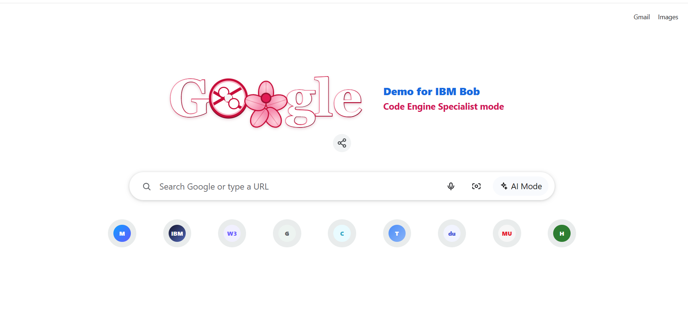

# HelenTestWebsite

A responsive React demo page inspired by a browser new-tab experience. The project is built with React, TypeScript, and Vite and is available through GitHub Pages.

## Preview



[View the live site](https://xiaojinse.github.io/HelenTestWebsite/)

## Tech stack

- React 19
- TypeScript
- Vite
- Nginx and Docker for container deployment

## Run locally

```bash
npm install
npm run dev
```

Vite will print the local development URL in the terminal.

## Build

```bash
npm run build
```

The production files are generated in `dist/`.
